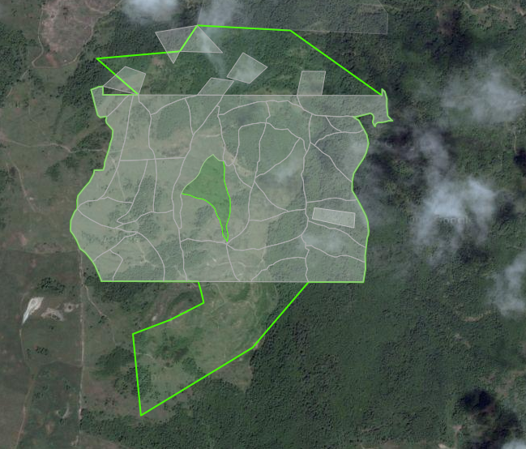



  

    

      

        

          

            

              
            

            

              <h3>Spatial&nbsp;Features</h3>
              
define, sketch, share

            

          

        

      

      

        

          

            

              
            

            

              <h3>Data&nbsp;Layers</h3>
              
public and private

            

          

        

      

    

    

      

        

          

            

              
            

            

              <h3>Collaboration</h3>
              
consensus driven process

            

          

        

      

      

        

          

            

              
            

            

              <h3>Flexible&nbsp;Analysis</h3>
              
visualize and report

            

          

        

      

    

    

        Madrona offers a flexible set of building blocks and design patterns for software development. Our portfolio of services, training, and support can help you develop, analyze, and implement effective place-based decision making–in any social or environmental context.
    

  

  

    

    <!-- Carousel items -->
      

      

        
        

          <h4>Forest Scenario Planner</h4>
          
The Murdock Charitable Trust wanted to help private forest landowners visualize alternative management scenarios.

        

      

      

        
        

          <h4>Second Thumbnail label</h4>
          
Cras justo odio, dapibus ac facilisis in, egestas eget quam. Donec id elit non mi porta gravida at eget metus. Nullam id dolor id nibh ultricies vehicula ut id elit.

        

      

      

    

    <!-- Carousel nav -->
    <a class="carousel-control left" href="#showcase" data-slide="prev">&lsaquo;</a>
    <a class="carousel-control right" href="#showcase" data-slide="next">&rsaquo;</a>
    

   

